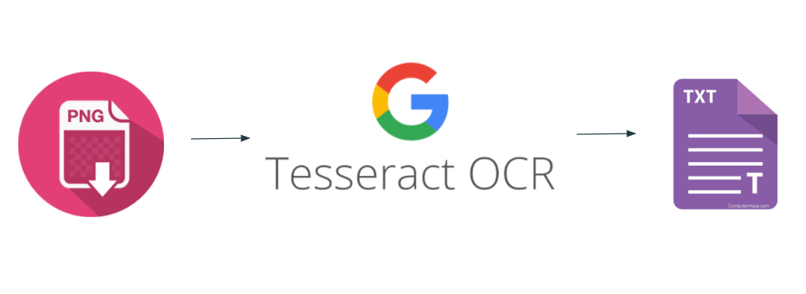

# Korean Text based OCR & Result Evaluation

## Overview
This project aims to evaluate Google's open source Tesseract OCR on Korean
image and text samples. 
OCR performance and data manipulation will be covered.

 - User will need to provide a png file of reference file
 - Execute Tesseract code onto converted png file
 - Compare output inferece file with original reference file

 

## Requirements
Following Project was done with:
 - [Tesseract](https://github.com/tesseract-ocr/tesseract)
    - Preferably get the pre-trained [Korean Language Pack](https://github.com/tesseract-ocr/tessdata_best)
 - Python 3.6+
 - [scikit-learn](https://scikit-learn.org/stable/)
    
## Usage

First, run Tesseract OCR shell file on the default images (or image of your choice, in ocr/ref_images)
```
   ./run_ocr.sh 
```


## Data
Data files can be characterized by their optimality:

| Structure | Korean Ratio | Format | Content |
| ------ | ------ | ------ | ------ |
| Perfectly structured | 100% Korean | Plain text without format | 국민교육현장 |
| Well structured | Some English words | Plain text in paragraphs | Professors’ Article |
| Decently structured |100% Korean | Bullet point format | Handong Notice | 
| Weakly structure | a few English characters | text with 1 chart | Dudu
Form 1 | 
| Badly structured | a few English characters | text with 2 charts | Dudu
Form 2 |

## Result & Performance 
Currently we measure the F1 score and accuracy of the original text file of
reference with the output inferece file. 

### By document

### By paragraph

### By each line

